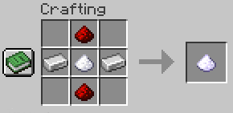
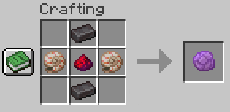

Give your Boats a little extra speed to make travelling over the ocean more enjoyable!

## About
With SpeedyBoats you can use different engines to make your boats faster. Just hold them in your main hand to get the extra boost. These engines can be crafted by every player and their speed can be set in the config.

I got inspired by the [BoatInertia](https://github.com/danvanbueren/BoatInertia/tree/main) plugin and the [BetterBoats](https://www.spigotmc.org/resources/betterboats.98545/) plugin

## Installation
- Download newest SpeedyBoats.jar from [Releases tab](https://github.com/siveryt/SpeedyBoats/releases)
- Load SpeedyBoats.jar into your `plugins/` directory on your Spigot or Paper server.
- Enjoy

### Tested Versions
- 1.20.1

## Engines
You just hold the crafted engine in your hand while steering a boat and you go way faster than without an engine.
### Level 1


### Level 2


_Note: In the middle is the engine level 1_

### Level 3


_Note: In the middle is the engine level 2_

## Configuration
Default `config.yml`:
```yaml
multiplierLVL1: 1
multiplierLVL2: 2
multiplierLVL3: 3
```

You can set the multiplier how fast the boats with different engines can go. The values you type in are NOT blocks/seconds.

## Contributing
Feel free to contribute to the plugin over here on GitHub. Just fork the repo, do your changes, test and submit a pull request. I'll take a look at it as soon as I can.

## Building
1. Clone the repo
2. Open in your IDE (I recommend [IntelliJ](https://www.jetbrains.com/idea/), as I built this plugin with [IntelliJ](https://www.jetbrains.com/idea/). For other IDEs please check other sourced on how to add the SpigotAPI)
3. Download SpigotAPI
4. Add as a module to the project
    - File > Project Structure > Modules
    - SpeedyBoats > Dependencies
    - Click `+` > JARs or Directories
    - Add your Spigot API
    - Scope: Compile; Export: Not ticked
    - Apply & Ok
5. Build > Build Artifacts... > SpeedBoats:jar > Build

Now you have the SpeedBoats.jar in `out/artifacts/SpeedyBoats_jar/SpeedBoats.jar`